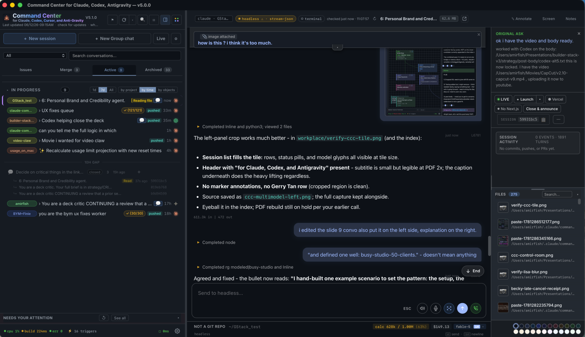

# CCC

**Your coding agents outgrew your terminal.**

CCC puts every session on one local board and tells you which one needs you.

_Start the next while Claude builds the first._

One local dashboard that attaches to every **Claude Code**, **Codex**, **Cursor**, **Antigravity**, **Kilo Code**, and **Kimi Code** session on your machine, however you launched it. Spawn, monitor, and ingest all six; steer five of them with follow-up. Local, open source, MIT.

> 📢 Shipping fast. **Watch → Releases** (top-right) to get pinged on new versions without the noise.



Install with curl:

```bash
curl -fsSL https://raw.githubusercontent.com/amirfish1/claude-command-center/main/scripts/install.sh | CCC_FROM=readme bash
```

With Homebrew:

```bash
brew tap amirfish1/ccc
brew install ccc
ccc
```

Or download the macOS DMG and drag `CCC.app` to Applications:
[github.com/amirfish1/claude-command-center/releases/latest](https://github.com/amirfish1/claude-command-center/releases/latest)

Try the read-only demo first: [ccc.amirfish.ai/demo](https://ccc.amirfish.ai/demo/) (or [amirfish1.github.io/claude-command-center/demo](https://amirfish1.github.io/claude-command-center/demo/)) - full kanban with seeded fake data, no install required.

<video src="https://github.com/amirfish1/claude-command-center/releases/download/v4.3.2.2/May-23-v4-CCC-v5.mp4" controls width="100%" poster="docs/images/kanban.png">
  Your browser doesn't support inline video. <a href="https://github.com/amirfish1/claude-command-center/releases/download/v4.3.2.2/May-23-v4-CCC-v5.mp4">Download the demo</a> or watch the GIF above.
</video>

CCC latches onto every Claude Code, Codex, Cursor, Antigravity, and Kilo Code session on your machine: terminal sessions, headless processes, and sessions you spawned from the dashboard. It treats each agent's on-disk state as the source of truth, so nothing slips through. Spawn the next task while the first is still building. Switch between projects without losing context. Ship multiple things at once.

See the [engine support matrix](#engine-support) below for what each engine does. Spawn, monitor, and transcript ingestion work across all six; follow-up (steering a dormant session) works on five (Kilo Code is fire-and-forget), and Cursor IDE sync is metadata-only by design.

## What you get

**See your whole fleet, past one session.** The way you build faster is a session per workstream: one on the feature, one on its go-to-market, one on the next feature, one on research. CCC puts every model and engine on one board, every row enriched so you read status without clicking in: a needs-you signal, live context left, a cost tier, and, with the Token Optimizer plugin, a quality score. Pin strategy sessions, nest workers under them, group by project, or lay the whole fleet out on a canvas.

**Stop wasting tokens, keep quality where it matters.** Your best model leads; execution fans out to cheaper models, or another platform entirely, through spawns, queues, and workers you point at any engine. CCC shows your pace against your plan's limits before you hit the wall, attributes a spend spike to the exact session or automation that caused it, and flags sessions running on a tier they don't need.

**Sessions that exchange context on their own.** Two sessions on one goal stay in sync through group chats and a sibling-ask API, instead of you reading one agent's output off one screen and retyping it into the other. Post once and every participant is pinged; ask a sibling synchronously when you need an answer right now; hand a problem to a fresh spawned session that reports back when it finishes.

**Workers that specialize over time.** Each worker reads its queue's shared learnings file before it starts and writes back to it when it ends, so a queue handling the same kind of ticket for months keeps getting faster and more accurate, not just busier. Ships via Watchtower, installed by default as CCC's queue engine.

**Find anything, from any session.** The problem you solved two weeks ago in some other session, found in seconds instead of solved again: full-text search across your session history, built in, zero setup, with an optional deeper semantic mode for when you can't remember the words you used. Covers Claude Code and Codex today.

**Work from anywhere.** Two sides of one opt-in: your phone as a client to the fleet, and CCC installed on any machine you can reach, a VM or a home server, open in any browser on your trusted network. Loopback by default, never the open internet.

## Why this exists

Most Claude Code orchestration tools are opinionated wrappers. They want to
own execution. You launch agents *through* them, and in return you get a
dashboard. That's fine until it isn't. The moment you open a terminal,
`claude --resume` something, and iterate on it by hand, you're outside the
tool's universe. The dashboard can't see it. The work you just did doesn't
show up on the kanban, against the issue, in the review queue.

This goes the other way. It treats Claude Code's on-disk state as the
source of truth: `~/.claude/projects/*.jsonl` transcripts, the
`~/.claude/sessions/<pid>.json` live registry, and per-tool-call sidecar
files written by two hooks we install into `~/.claude/settings.json`. If
Claude Code is running anywhere on your machine, it shows up here. If you
close the dashboard, your sessions keep running. If you open a terminal and
iterate by hand, the card updates.

The dashboard also knows how to *spawn* headless sessions (via
`claude -p --input-format stream-json`) and *resume* dormant ones on demand,
but those are additive. The thing it's built around is attaching to work
that already exists.

## How it compares

|  | Raw terminal + tmux | Wrapper that owns execution | CCC |
|---|:---:|:---:|:---:|
| Sees sessions you launched by hand | if you remember the tab | no, only what it spawned | yes, reads on-disk state |
| Survives closing the dashboard | yes | varies | yes, the dashboard is a lens, not a runtime |
| One board across engines | no | usually one engine | yes, six engines |
| Tells you which session needs you | no | no | yes, read from the transcript |
| Coordinates sessions without you as the relay | no | no | yes, group chats + sibling-ask |
| Setup | none | proxy or routing config | one curl line, no accounts |

The whole point is the first row: the moment you touch a terminal, a tool that owns execution goes blind. CCC reads the state the engines already write, so it never does.

## Recent

- **2026-07-20**: **v5.9.0**. **Kimi Code joins as the sixth engine** (spawn, steer, live token streaming, guided setup in Settings). **Q-FIRST**: open CCC as a queue board — queue cards with WatchTower health, full ticket detail, one-click bridge into the worker's session. Plus a FIRST FLIGHT onboarding tour, a searchable full settings modal (Cmd/Ctrl+,), a cost-aware cold-session composer that offers ranked cheaper routes instead of a blind expensive resume, a 12-skill orchestration pack, plan-to-fleet queue import, and a perf pass that gets new sessions into the list in seconds.
- **2026-06-25**: **v5.4.0**. **Project tree**: the "By objects" sidebar now splits a live "Current sessions" triage band over a hierarchical map of your day, sessions grouped under nestable, draggable Flow objects. Plus a new `/api/sessions/events` SSE stream (subscribe to session-state changes instead of polling) and a broad Codex, sidebar, and Total Recall search polish wave.
- **2026-06-03**: **v4.6.0**. Major performance pass: the dashboard idles instead of pinning a CPU core, group-chat opens ~40x faster, long conversations open near-instantly (windowed load + scroll-up to load earlier), and Codex sessions with screenshots no longer stall on multi-MB images. New CCC self-health readout in the footer.
- **2026-05-21**: **v4.0.0**. Antigravity (Google DeepMind) joins the dashboard as a first-class engine alongside Claude Code and Codex.
- **2026-05-21**: Drag any conversation row outside the window to pop it into a focused side pane, with 24 per-conversation accent colors.
- **2026-05-19**: Template gallery mechanism for reusable new-session prompts, driven by `static/templates.json`. ([#46](https://github.com/amirfish1/claude-command-center/issues/46))
- **2026-05-19**: VS Code extension v0.1.0 published, spawn a session from the active workspace folder. ([#52](https://github.com/amirfish1/claude-command-center/issues/52))
- **2026-05-19**: One-command `curl | bash` installer; `git clone` demoted to a "From source" section. ([#58](https://github.com/amirfish1/claude-command-center/pull/58))
- **2026-05-19**: Static GitHub Pages demo with seeded mock data (no install required). ([#49](https://github.com/amirfish1/claude-command-center/issues/49))
- **2026-05-18**: Local macOS `say` text-to-speech button on conversations.

[](https://star-history.com/#amirfish1/claude-command-center&Date)

> **If you install it, I'd love to hear how.** Drop a ⭐, open an issue with
> what worked or what broke, or just say hi. This is a one-person project
> built around a specific workflow. Outside feedback is the only way I know
> how widely it lands. [@amirfish1](https://github.com/amirfish1)

## Quickstart

**Try the demo:** [ccc.amirfish.ai/demo](https://ccc.amirfish.ai/demo/): read-only kanban with seeded fake data, no install required.

Requirements: Git and Python 3.9+. Install at least one supported agent CLI to
launch sessions: [Claude Code](https://docs.claude.com/en/docs/claude-code),
Codex, Gemini, or Antigravity. The dashboard itself starts without an agent CLI.
Optional: [`gh`](https://cli.github.com/) for GitHub integration, `vercel` for deploy status.
Linux is supported for headless / remote-box use (see [Running on Linux](#running-on-linux)); the macOS-only desktop conveniences degrade cleanly there.
Windows is supported for native foreground use with PowerShell, and WSL2 remains
the best route if you want the Linux service path.

**curl**: clones into `~/.ccc/claude-command-center` and runs in foreground. Re-running does a `git pull`.

```bash
curl -fsSL https://raw.githubusercontent.com/amirfish1/claude-command-center/main/scripts/install.sh | CCC_FROM=readme bash
```

**Windows PowerShell**: clones into `%USERPROFILE%\.ccc\claude-command-center`
and runs in foreground. Re-running does a `git pull`.

```powershell
irm https://raw.githubusercontent.com/amirfish1/claude-command-center/main/scripts/install.ps1 | iex
```

**Homebrew** — installs into the Cellar, puts `ccc` on `PATH`, pins a brew-managed Python. Upgrade via `brew upgrade ccc`.

```bash
brew tap amirfish1/ccc
brew install ccc
ccc                              # foreground
brew services start ccc          # or run as a brew-managed background service
```

**DMG** — drag the app to Applications and double-click to launch. On first
launch, the signed and notarized app installs its local source into
`~/.ccc/claude-command-center`, shows progress, and opens the dashboard when its
loopback server is ready. Installation errors include the real log plus Retry,
Open Log, and Quit actions. CCC does not automate Terminal or request macOS
Automation access. Download the [latest release](https://github.com/amirfish1/claude-command-center/releases/latest).

If you'd rather clone first and run the script directly, pass the channel as a flag instead: `./scripts/install.sh --from=readme`.

### From source

```bash
git clone https://github.com/amirfish1/claude-command-center
cd claude-command-center

# Try it. Runs in the foreground until Ctrl-C / terminal close
./run.sh

# Keep it. Install as a per-user launchd agent that starts now and at login
./run.sh --install-service
```

Open [http://localhost:8090](http://localhost:8090), then pick a repo from
the repo dropdown before starting repo-scoped actions.

`--install-service` writes `~/Library/LaunchAgents/com.github.claude-command-center.plist`
and registers it in your per-user launchd domain so CCC starts immediately,
restarts if it exits, and starts again at macOS login. It bakes in whatever
`PORT` / `CCC_*` env vars were set when you ran it. Re-run it to update config;
check with `./run.sh --service-status`; remove with `./run.sh --uninstall-service`.
Service logs go to `~/.claude/command-center/logs/service.{out,err}.log`.
Normal CCC app updates keep using the same checkout path; re-run
`./run.sh --install-service` only when you want to change baked-in env vars or
pick up a release that changes the launchd plist itself.

### Running on Windows

CCC runs natively on Windows as a foreground PowerShell process. The dashboard,
session ingestion, repo picker, and agent spawn paths use the same Python server
as macOS/Linux. macOS-only desktop conveniences (screenshots, jump-to-terminal,
native folder picker, Finder reveal, desktop deep links) are hidden on Windows
the same way they are on Linux.

```powershell
git clone https://github.com/amirfish1/claude-command-center
cd claude-command-center

# Try it. Runs in the foreground until Ctrl-C / terminal close
.\run.ps1

# Optional: open the dashboard as a chromeless Chromium app window
.\run.ps1 --app
```

Open [http://localhost:8090](http://localhost:8090), then pick a repo from
the repo dropdown before starting repo-scoped actions. Native Windows service
install is not implemented yet; keep the PowerShell window open or run
`.\run.ps1` under your preferred process manager.

If you prefer Linux-style service management on Windows, run CCC inside WSL2
and use the Linux instructions below.

### Running on Linux

CCC runs on Linux as a headless service you reach from the browser on another
machine. The core (kanban, `~/.claude` transcript ingestion, session spawn and
drive) works the same as on macOS. The macOS-only desktop conveniences
(screenshots, jump-to-terminal, open-in-desktop, native folder picker) are
not available on Linux yet; the UI hides those controls automatically, so you
never see a button that does nothing.

Windows users who want a systemd-managed service can use this Linux path under
WSL2. Install Python 3, git, and your agent CLIs inside the WSL distro, then
open `http://localhost:8090` from the Windows browser after `./run.sh` starts.

```bash
git clone https://github.com/amirfish1/claude-command-center
cd claude-command-center

# Try it in the foreground
./run.sh

# Keep it. Installs a systemd user service that starts now and at login
./run.sh --install-service
```

`--install-service` writes a systemd user unit to
`~/.config/systemd/user/ccc.service` and runs `systemctl --user enable --now`.
Check it with `./run.sh --service-status` (or `systemctl --user status ccc`),
follow logs with `journalctl --user -u ccc -f`, and remove it with
`./run.sh --uninstall-service`. On a headless box with no active login session,
run `sudo loginctl enable-linger $USER` once so the service survives logout and
starts at boot. If `systemctl` is not available, run CCC in the foreground or
under your own process manager instead.

In WSL2, `./run.sh --install-service` requires a distro with systemd enabled.
If your WSL distro does not expose `systemctl --user`, keep CCC in the
foreground with `./run.sh` or run it under your own process manager.

To reach the dashboard from another machine, see `SECURITY.md` for the
`CCC_BIND_HOST` and same-origin options before exposing the port.

First launch (foreground or service) copies two hook scripts into
`~/.claude/command-center/hooks/` and registers them in
`~/.claude/settings.json`. After that, every Claude Code session on your
machine (terminal, headless, or dashboard-spawned) writes sidecar state
the UI uses for the kanban.

## Core concepts

```
┌─────────────┐   writes   ┌────────────────────────────────┐
│ any claude  │ ─────────> │ ~/.claude/projects/*.jsonl     │
│ process     │            │ ~/.claude/sessions/<pid>.json  │
│ anywhere on │            │ ~/.claude/command-center/          │
│ your machine│            │   live-state/<sid>.json        │
└─────────────┘            └──────────────┬─────────────────┘
                                          │  reads
                                          v
                              ┌───────────────────────┐
                              │ server.py (stdlib)    │
                              │ :8090                 │
                              └───────────┬───────────┘
                                          │
                                          v
                              ┌───────────────────────┐
                              │ static/index.html     │
                              │ kanban + detail pane  │
                              └───────────────────────┘
```

- **Session**: any Claude Code transcript on disk, alive or dormant.
- **Attach**: the server reads Claude's own files + sidecar state the
  installed hooks write after every tool call. Nothing to configure
  per-session.
- **Columns**: Backlog → Planning → Working → Review → In Testing →
  Verified / Inactive / Archived. Columns are derived from session state
  (live? commits? pushed? sidecar activity?), overridable by drag.
- **Backlog**: open GitHub issues + `TODO.md` entries, surfaced as cards
  next to your active sessions so everything lives on one board.
- **Objects & the Project tree**: group sessions under named, nestable
  **Flow objects** to build a hierarchical map of the day's work. The
  sidebar's "By objects" view splits this tree from a live "Current
  sessions" triage band (last 5h), so structure and live activity stay
  side by side.

## Engine support

CCC was built around Claude Code first; Codex, Cursor, Antigravity, Kilo Code, and Kimi Code support followed. Spawn-from-dashboard works for all six. The rest varies:

| Engine        | Spawn (headless from UI) | Resume (terminal inject / headless resume) | Transcript ingestion | Per-session model picker |
|---------------|--------------------------|--------------------------------------------|----------------------|--------------------------|
| Claude Code   | yes                      | yes (both)                                 | yes — first-class JSONL (`~/.claude/projects/*.jsonl`) | yes — UI picker, incl. 1M-context toggle |
| Codex         | yes                      | yes (both)                                 | partial — Codex JSONL parsed, broader parity tracked in [#57](https://github.com/amirfish1/claude-command-center/issues/57) | yes — UI picker via per-session override; default from `CCC_CODEX_MODEL` |
| Cursor        | yes — headless via `cursor-agent` | yes — follow-ups route through `cursor-agent --resume` | partial — Cursor agent transcripts parsed from `~/.cursor/projects/` | yes — UI/default model picker; default from `CCC_CURSOR_MODEL` |
| Antigravity   | yes — headless via `agy` print mode | yes — follow-ups route through AGY CLI or the running app's language-server RPC | yes — JSONL transcripts from `~/.gemini/antigravity/brain/` | auto-detected from transcript metadata |
| Kilo Code     | yes — headless via `kilo run --auto` | no — fire-and-forget headless run, no resume wiring yet | yes — reads Kilo's SQLite store (`~/.local/share/kilo/kilo.db`); externally-launched sessions appear on the board | yes — UI/default model picker; default from `CCC_KILO_MODEL` |
| Kimi Code     | yes — ACP client over `kimi acp`, token-level live streaming | yes — steer live ACP sessions with inline permission-prompt answers; attach for TUI sessions | yes — reads `~/.kimi-code/sessions/`; live list and archive | yes — UI/default model picker; default from `CCC_KIMI_MODEL` |

**Note on Cursor IDE integration:** While CCC spawns Cursor agents headlessly via the CLI, the Desktop IDE manages UI state internally using a highly-nested, proprietary Protobuf Merkle tree in `store.db`. Full "two-way chat sync" into the IDE is unsupported due to the extreme risk of workspace corruption. Instead, CCC performs a **metadata integration**: CLI sessions are injected into the IDE sidebar as bookmarks (with correct titles and timestamps) so you don't lose track of them, but they cannot be interacted with natively inside the IDE window. Use the CCC dashboard for full history.

If you'd like to see an engine bumped from "partial" to first-class, open an issue — it's mostly adapter work, the ingestion layer is engine-agnostic.

## Features

- **One board, six engines**: spawn, resume, and review **Claude Code**, **Codex**, **Cursor**, **Antigravity**, **Kilo Code**, and **Kimi Code** sessions from one dashboard. See the [engine support matrix](#engine-support) for per-engine parity. Kimi Code has a guided setup flow in Settings → Engines that detects the CLI, walks through install and `kimi login`, and verifies with a smoke-test spawn.
- **Queue-first mode (Q-FIRST)**: open CCC as a queue board — queue cards with WatchTower health, a queue's tickets in the main view, a full ticket detail panel (edit, answer, comment, close with a note, reopen), and a one-click bridge into the worker's session (or spawn a one-off worker). Activate per-load with `?ccc_mode=queues`, from the Queue tab's Board button, or pin it as your default landing view.
- **Cost-aware cold-session composer**: when a session is large and stale, the send button is replaced by ranked routes — continue in a new session on a cheaper tier, search history, copy session id — with the full (expensive) resume demoted to a priced link. Routes are ranked by intent: question-shaped text promotes search, task-shaped text promotes continuing fresh.
- **FIRST FLIGHT tour**: a spotlight walkthrough of the dashboard on first run, with newcomer and multi-engine paths and sample cards on empty installs. Replay any time from Settings.
- **Settings modal**: the gear menu is a full settings modal with instant search (Cmd/Ctrl+, to open), keyboard navigation, and per-section reset — appearance, layout, sessions, fleet & network, tools, maintenance, help.
- **Plan-to-fleet**: import a plan or mission-brief document into a WatchTower queue from the dashboard — preview the tickets `wt import` extracts, file them on confirm, optionally drain with a worker.
- **ACP adapter** (optional): expose CCC over the [Agent Client Protocol](https://agentclientprotocol.com) so editors and ACP clients (VS Code, JetBrains, Zed, and agents like Hermes) can drive Claude Code sessions over JSON-RPC stdio. Runs as a separate process (`python3 ccc_acp.py`); install with the `acp` extra. The core server stays stdlib-only.
- **Kanban** across every session, with drag-drop between columns,
  rubber-band multi-select, and per-column tinting.
- **Project tree**: the sidebar's **By objects** view stacks a live
  **Current sessions** band (everything active in the last 5h) over a
  **Project tree** — your day's work as a hierarchy, with sessions grouped
  under nestable **Flow objects** you name, drag, and reparent. Drag the
  divider to resize the two bands; collapse branches you're not using. The
  structured map sits beside the live triage list, so "what's running now"
  and "how it all fits" share one pane instead of one scrolling list.
- **Split conversations**: drag any sidebar session onto the right or
  bottom edge of the open conversation to view two transcripts
  side-by-side, each with its own input bar. Closes back to single-pane
  with a click; collapses automatically below 900px.
- **GitHub integration**: start a session from an issue with one click
  (auto-adds `claude-in-progress` label + self-assigns). Verify closes the
  issue with a commit-SHA comment. Drag to Archived closes as "not
  planned". Issue body + comments render inside the dashboard (no iframe;
  GitHub blocks that).
- **Attach to existing sessions**: terminal `claude` processes show up
  automatically. Jump-to-terminal focuses them by TTY; rename/color the
  tab via Claude's own slash commands.
- **Open in Claude Desktop** (macOS): third destination button beside
  Jump/Launch in the conversation toolbar; resumes the current CLI
  session inside the Claude Desktop app via the `claude://resume` deep
  link.
- **Fresh worktree spawns**: toggle worktree mode to launch a session in
  `<repo>-wt/<slug>/` on `feat/<slug>`. Optional
  [`.ccc/worktree-init`](docs/worktree-init.md) scripts can copy local env
  files or install dependencies before the agent starts.
- **Headless spawn with follow-up**: launch `claude -p` sessions from the
  dashboard and keep talking to them via an in-browser input bar (no
  terminal needed, stdin pipe stays open).
- **Resume-on-demand**: injecting into a dormant session auto-spawns a
  headless `claude --resume` to deliver the message.
- **Auto-fix deploys**: optionally polls Vercel, spawns a `/fix-deploy`
  session on new production ERRORs (deduped by commit SHA).
- **AI-assisted titles**: click ✨ on any card to regenerate its title
  via `claude -p` (Haiku by default). Used for cleaning up auto-generated
  session slugs.

## Orchestration skill

CCC ships a Claude Code skill (`ccc-orchestration`) that lets one Claude
session spawn, inject into, and synchronously ask sibling sessions over
plain HTTP. On top of it sits a 12-skill orchestration pack
([`skills/README.md`](skills/README.md)) that turns spawn/inject/ask into
concrete workflows — `pair-verify`, `standup`, `second-opinion`, `bug-race`,
`docs-drift`, `release-audit`, and more — each with stated spawn cost, a
dry-run mode, and an honest fallback when CCC is down. On startup the server copies the skill to
`~/.claude/skills/ccc-orchestration/SKILL.md` (set
`CCC_SKIP_SKILL_INSTALL=1` to opt out) and writes its base URL to
`~/.claude/command-center/port.txt` so the skill can discover the running
instance without hardcoding a port.

Spawn calls pass `repo_path` (or `cwd`) plus optional
`engine: "claude" | "codex" | "cursor" | "antigravity" | "kilo" | "kimi"` to `/api/sessions/spawn`;
omitted engine/model values use the server-side defaults from the dashboard.
Legacy `engine: "gemini"` maps to Antigravity. Successful spawns return
`spawn_id`, `engine`, `repo_path`, `cwd`, optional `parent_session_id`, and
`session_id` when the native engine has emitted one; callers can poll
`/api/sessions/spawned` if `session_id_pending` is true. Passing `report_to`
(or explicit `parent_session_id`) links spawned sibling sessions under the
dispatcher in Current Sessions.

Once installed, a Claude session can run e.g.:

```bash
CCC_URL="$(cat ~/.claude/command-center/port.txt)"
REPO_PATH="$(pwd -P)"
curl -s "$CCC_URL/api/sessions?repo_path=$(python3 -c 'import urllib.parse,sys; print(urllib.parse.quote(sys.argv[1]))' "$REPO_PATH")"

curl -s -X POST "$CCC_URL/api/ask" \
  -H "Content-Type: application/json" \
  -d '{"session_id": "<uuid>", "text": "What is 2+2?", "timeout_ms": 30000}'
# -> {"ok": true, "text": "4", "cost_usd": ..., "duration_ms": ..., "num_turns": 1}
```

Use this for **persistent peer sessions** (a marketing assistant, a deploy
babysitter) that should survive past the current turn and show up on the
kanban, not for one-shot internal subtasks (the built-in `Task` tool is
better for those).

Read-only usage integrations can poll `GET /api/usage/current` for CCC's
consolidated local usage state: Claude plan windows, Codex rate-limit windows,
Kimi usage windows, pace projections, calibration metadata, recent reset
events, and `fetched_at`.
Fields are nullable so external tools can gracefully degrade when a provider
has not emitted usage yet.

## Works with your skills

CCC does not replace the Claude Code skill packs you already run. It gives them
a fleet. Full write-up: [docs/skills-ecosystem.html](https://ccc.amirfish.ai/skills-ecosystem.html)
and the honest [inventory](docs/skills-ecosystem-inventory.md).

- **Superpowers subagents surface on your board.** When a superpowers skill fans
  out `Task` subagents (dispatching-parallel-agents, subagent-driven-development),
  CCC counts them from the transcript and shows a subagent chip plus a live status
  rail on the parent session row. No change to the pack.
- **`superpowers-to-watchtower`** (bundled skill) lifts a superpowers plan out of
  its in-session scratch ledger: `wt import` turns it into durable, board-visible
  Watchtower tickets, then optionally dispatches one CCC lane per ticket that
  closes with a summary.
- **`fleet-verify`** (bundled skill) spawns one CCC lane that drives gstack browse
  (puppeteer fallback) against the running app and reports a visual verdict with a
  screenshot. The check `/code-review` and a unit test cannot make.
- **`GET /api/skills`** inventories CCC's own bundled skills plus every installed
  third-party pack, each annotated with honest fleet-synergy flags
  (`spawns_subagents`, `fleet_aware`, `drives_browser`, `ccc_synergy`). stdlib-only
  and mtime-cached, so a dashboard can poll it for free.

The `superpowers-to-watchtower` and `fleet-verify` skills install on startup
alongside `ccc-orchestration` (opt out with `CCC_SKIP_SKILL_INSTALL=1`). What is
wired today is kept plainly separate from what is roadmap, in both the docs page
and the matrix populated by `/api/skills`.

## Cookbook

Recipes for wiring **your own app** into CCC — each with a copy-paste prompt
you can hand to Claude Code so it implements the integration for you:

- [Annotate → UX-fixes queue](cookbook/annotate-to-ux-fixes-queue.md) — click
  an element in your running app, type a note, and it becomes a numbered work
  item a Claude session claims and fixes.
- [In-app bug report widget → GitHub issue](cookbook/bug-report-widget-github-issues.md)
  — a floating "Report an issue" button that screenshots the page and opens a
  fully-contextualized GitHub issue, plus a customer-facing status view
  derived live from GitHub labels.

## Architecture

Two files: a single Python file (stdlib-only HTTP server) and a single HTML
file (vanilla JS, no framework, no build). State lives in JSON sidecar
files under `~/.claude/command-center/`, all human-readable, all rewriteable
by hand.

The server has no background workers. Every API request scans Claude's
session directories, merges in sidecar state, enriches with cached GitHub
issue data, and returns a flat list. The client classifies into columns
using rules like "has_push → Review", "live + sidecar_has_writes → Working".

Hooks are the only invasive thing. On first run the server copies
`hooks/post-tool-use.py` and `hooks/stop.py` to `~/.claude/command-center/hooks/`
and merges entries into `~/.claude/settings.json`. After that, Claude Code
fires them after every tool invocation, each hook writes a tiny JSON file
under `live-state/`, and the server reads those to answer "is this session
actually doing something right now or is it idle waiting for input?".

For more depth: [`docs/architecture.md`](docs/architecture.md),
[`docs/session-attach.md`](docs/session-attach.md).

## Configuration

| Env var | Default | Purpose |
|---|---|---|
| `PORT` | `8090` | HTTP port |
| `CCC_CLAUDE_BIN` | *(auto)* | Absolute path to the Claude Code CLI when a launchd service cannot see your shell PATH. Set it before `./run.sh --install-service` to bake it into the agent. |
| `CCC_CURSOR_BIN` | *(auto)* | Absolute path to `cursor-agent` if it is not on the service PATH. |
| `CCC_CURSOR_MODEL` | `auto` | Default model for Cursor spawns/resumes when no dashboard or API model override is set. |
| `CCC_KILO_BIN` | *(auto)* | Absolute path to the Kilo Code CLI (`kilo`) if it is not on the service PATH. |
| `CCC_KILO_MODEL` | `kilo/stepfun/step-3.7-flash:free` | Default model for Kilo spawns when no dashboard or API model override is set. |
| `CCC_BIND_HOST` | `127.0.0.1` | Interface to bind. Set to `0.0.0.0` to expose on the LAN. **No auth, see [`SECURITY.md`](SECURITY.md)** |
| `CCC_ALLOWED_ORIGIN` | *(empty)* | Comma-separated origins (e.g. `http://my-mac.tailnet.ts.net:8090`) added to the same-origin POST allowlist. Use with `CCC_BIND_HOST=0.0.0.0` to reach the UI from another device on a trusted network (Tailscale / VPN). **No auth, see [`SECURITY.md`](SECURITY.md)** |
| `CCC_TRUST_TAILNET` | *(off)* | When set (`1`/`true`/`yes`/`on`), CCC shells out to `tailscale status --json` at startup and adds the local node's MagicDNS hostname + Tailscale IPs to the allowlist automatically. Same trust caveat as `CCC_ALLOWED_ORIGIN`. |
| `CCC_TITLE_STRIP` | *(empty)* | Comma-separated prefixes to strip from GitHub issue titles (e.g. `ACME,FOO` strips `[ACME ...]` and `[FOO ...]`) |
| `CCC_SPAWN_IDLE_TTL_HOURS` | `3` | Hours of total inactivity (spawn log, stdin FIFO, and session transcript all quiet, no running tool) before a CCC-spawned persistent headless worker is retired with a graceful SIGTERM. Their FIFO stdin means finished workers never exit on their own; retired sessions stay resumable. Set `0` to disable the sweep. |
| `CCC_ORG_PATTERNS` | *(empty)* | Multi-tenant org-tagger. Format: `Label1:pat1a\|pat1b;Label2:pat2`. Each issue body is scanned and tagged with the first matching label so the UI can group backlog by org. |
| `VERCEL_PROJECT` | *(unset)* | Vercel project name. Leave empty to disable deploy polling. |
| `CCC_TELEMETRY_DISABLED` | *(unset)* | Set to `1` to hard-disable the anonymous opt-in daily ping at the process level. Telemetry is **off by default** — the env var is the corporate / CI kill switch that also hides the consent banner. Full contract: [`docs/telemetry.md`](docs/telemetry.md). |

The `CCC_BIND_HOST`, `CCC_ALLOWED_ORIGIN`, and `CCC_TRUST_TAILNET` knobs can also be set in `~/.claude/command-center/network.json` so they survive shell restarts, or flipped from the **Network access…** entry in the sidebar settings popover. Env vars always win, useful for CI / one-shot overrides. The same security caveats apply: every trusted origin can run commands as you.

For any other env var (not just the network ones above), `run.sh` sources `~/.claude/command-center/config.local.env` if present, before doing anything else — plain `KEY=value` lines, same as a shell `.env` file. This machine-local file is never part of the repo (it lives outside the working tree, so there's nothing to gitignore). It's the fix for a real gap: `launchctl setenv`/`systemctl --user set-environment`-style overrides don't survive a reboot, but a var set in this file does, and it's baked into the launchd plist / systemd unit the same way a real env var is when you run `--install-service`.

## Python stack diagnostics

On macOS and Linux, a running CCC server can dump every Python thread's stack
without `sudo`, installing a debugger, or restarting the service. Resolve the
server's current port and send it `SIGUSR2`:

```bash
CCC_PORT="$(sed 's/.*://' ~/.claude/command-center/port.txt)"
CCC_PID="$(lsof -nP -iTCP:"$CCC_PORT" -sTCP:LISTEN -t | head -1)"
kill -USR2 "$CCC_PID"
tail -n 200 ~/.claude/command-center/logs/python-stacks.log
```

Each signal appends a traceback for all Python threads to the same diagnostics
log. This is useful when the dashboard is alive but a request appears stuck.
The signal is unavailable on Windows.

## Roadmap

**Shipped**
- Kanban over all live + dormant Claude Code, Codex, Cursor, Antigravity, and Kilo Code sessions
- GitHub issue → session → verify → close pipeline
- Headless spawn with stdin-pipe follow-up
- Resume-on-demand
- Auto-fix-deploy (Vercel)
- AI title regeneration
- Cursor — session cards, transcript ingestion, headless spawn/resume via `cursor-agent`
- Antigravity (Google DeepMind) — full session view, transcript ingestion, headless resume via AGY CLI or app RPC
- Kilo Code — headless spawn via `kilo run --auto`, engine selector + model picker, and read-only ingestion of externally-launched sessions from Kilo's SQLite store
- ACP adapter — drive Claude Code sessions over the Agent Client Protocol (`ccc_acp.py`, optional)

**Not yet**
- First-class parity for Codex. Spawn, resume, and JSONL transcript parsing
  work, but broader UX polish still lags behind Claude Code — see the
  [engine support matrix](#engine-support) and
  [#57](https://github.com/amirfish1/claude-command-center/issues/57).
- Kilo Code resume / follow-up. Spawn and read-only ingestion both work
  (externally-launched sessions appear on the board and open with full
  transcripts); injecting follow-up turns into a Kilo session is not wired yet.
- More agent runtimes (Aider, OpenCode, etc.). The ingestion layer is
  engine-agnostic; adapters just don't exist yet.
- Code split. `server.py` and `index.html` are each one huge file on
  purpose, so you can read the whole product in an afternoon. That tradeoff
  bends eventually; it hasn't yet.

**Out of scope**
- Desktop-Linux parity. Linux is supported headless (see
  [Running on Linux](#running-on-linux)) with a systemd service and clean
  degradation of the macOS-only desktop glue. Native Linux equivalents for
  screenshots, jump-to-terminal, and deep links (X11/Wayland, wmctrl/tmux) are
  a possible follow-on, not a current goal. Native Windows uses the same
  degraded desktop capability set and currently runs as a foreground
  PowerShell process.
- Multi-user / network-exposed mode. This is a local dev tool. If you're
  looking at it on a remote host, something has gone wrong.
- Electron / native wrap. Browser is the UI on purpose.

## Contributing

See [`CONTRIBUTING.md`](CONTRIBUTING.md).

## License

[MIT](LICENSE) © 2026 Amir Fish

## Acknowledgments

Built on top of [Claude Code](https://docs.claude.com/en/docs/claude-code).
The `gh` CLI and Vercel CLI are optional integrations but do most of the
heavy lifting where they're used.
