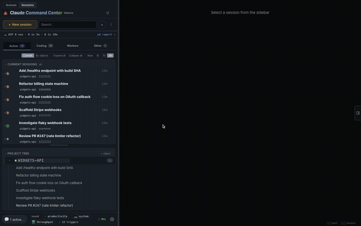
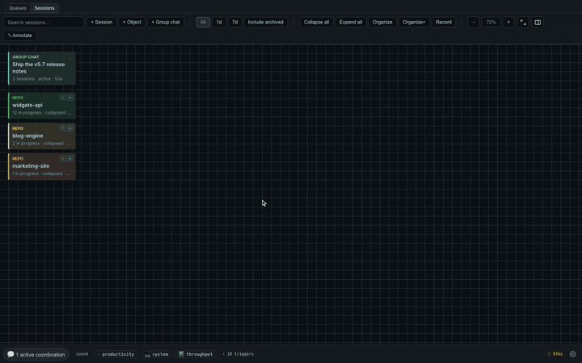
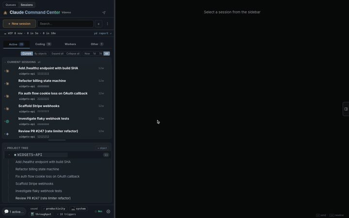
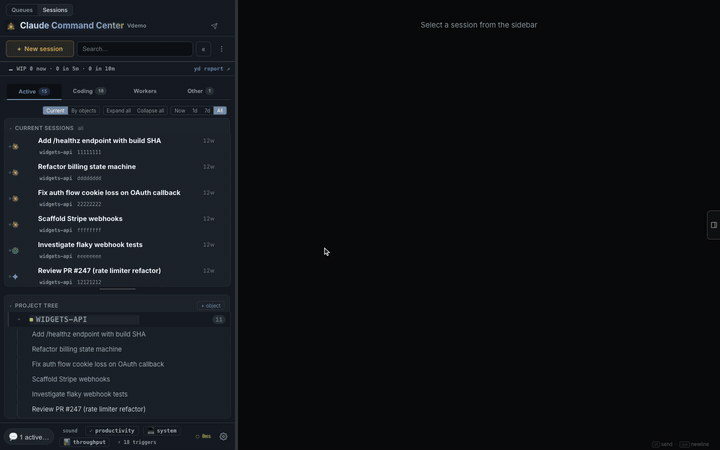
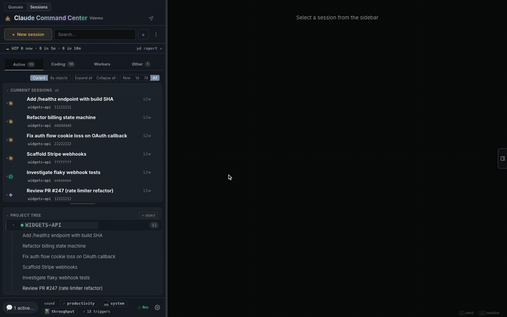
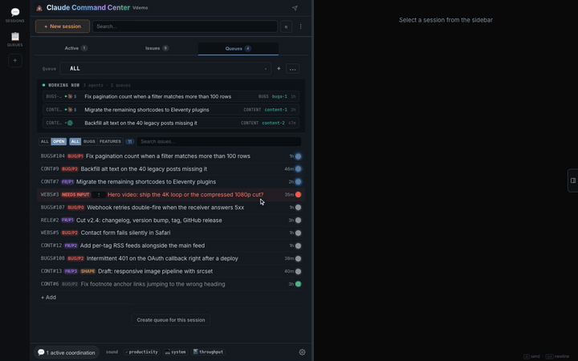
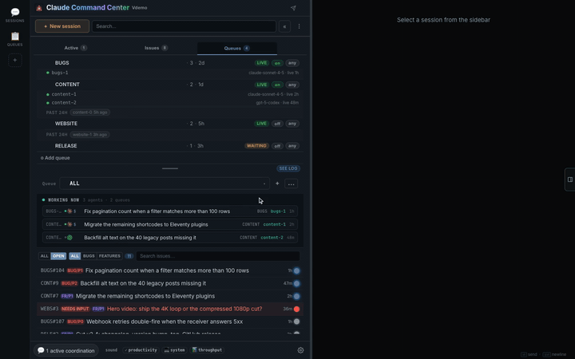
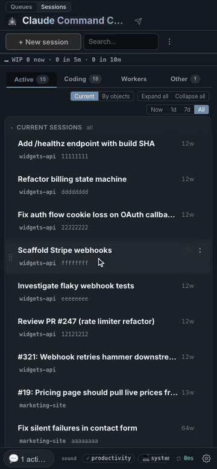
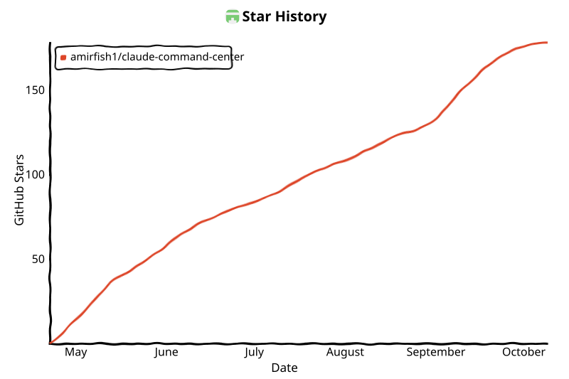

# CCC

[](https://github.com/amirfish1/claude-command-center/actions/workflows/ci.yml)
[](https://github.com/amirfish1/claude-command-center/releases)
[](https://github.com/amirfish1/claude-command-center/stargazers)
[](LICENSE)


[](CONTRIBUTING.md)


**Your coding agents outgrew your terminal.**

CCC puts every session on one local board and tells you which one needs you.

_Start the next while Claude builds the first._

> “Hey Amir, great product. I tried about 20 before finding yours. I have been really enjoying it.”  
> CCC user

One local dashboard for **Claude Code**, **Codex**, **Cursor**, **Antigravity**,
**Kilo Code**, **Kimi Code**, **OpenCode**, and **Devin**, however you launched them.
Spawn and monitor all eight; send follow-up on seven. Kilo Code is fire-and-forget.
CCC is local, source-available, and free to use and modify, including at work.


Install with curl:

```bash
curl -fsSL https://raw.githubusercontent.com/amirfish1/claude-command-center/main/scripts/install.sh | CCC_FROM=readme bash
```

With Homebrew:

```bash
brew tap amirfish1/ccc
brew install ccc
ccc
```

Or download the [macOS DMG](https://github.com/amirfish1/claude-command-center/releases/latest)
and drag `CCC.app` to Applications.

Try the [read-only demo](https://ccc.amirfish.ai/demo/) first: the full dashboard
with seeded fake data, no install required. [Alternate demo](https://amirfish1.github.io/claude-command-center/demo/).

## Start free in 5 minutes

New to coding agents? The first-run wizard checks your machine, helps install
Node, the Claude Code CLI, and a local free-model router, then runs your first
real task on a **$0 model**. You approve each install step. It ends with the
honest math: *"This run cost $0. At API prices it would have cost $X."*

[Walk through setup](docs/onboarding.md) · [Free providers and privacy](docs/free-models.md).
Free providers have their own limits. The keyless provider logs prompts for
training; CCC asks for consent before enabling it. Do not send it private code.

## See CCC at work

<table>
<tr>
<td width="50%" valign="middle">

### One board, eight engines

See sessions you started in a terminal or from CCC. Each agent's own files
keep the list up to date.

</td>
<td width="50%">
  
</td>
</tr>
<tr>
<td width="50%">
  
</td>
<td width="50%" valign="middle">

### Flow canvas & Project tree

Group sessions by the work they belong to. Keep your live sessions next to
a map of your projects.

</td>
</tr>
<tr>
<td width="50%">
  
</td>
<td width="50%" valign="middle">

### Split conversations

Drag a session onto the edge of an open conversation to read two agents
side by side. Each has its own input bar.

</td>
</tr>
<tr>
<td width="50%" valign="middle">

### Find anything, from any session

Search your session history without extra setup. An optional semantic mode
helps when you cannot remember the exact words.

</td>
<td width="50%">
  
</td>
</tr>
<tr>
<td width="50%">
  
</td>
<td width="50%" valign="middle">

### Sessions that coordinate without you

Post once to a group chat and every participant gets the message. No copying
answers between terminals.

</td>
</tr>
<tr>
<td width="50%" valign="middle">

### Durable queues, one inbox

Put work in a [WatchTower](https://github.com/amirfish1/watchtower) queue.
Tickets survive closed sessions, and workers can pick them up in parallel.

</td>
<td width="50%">
  
</td>
</tr>
<tr>
<td width="50%">
  
</td>
<td width="50%" valign="middle">

### Workers that specialize over time

Workers read their queue's shared learnings before a task and write back
afterwards, so the next worker has that experience.

</td>
</tr>
<tr>
<td width="50%" valign="middle">

### Work from anywhere

Monitor sessions and reply from your phone on a trusted network. CCC stays
local by default. **Settings > Phone access** guides you through Tailscale.
[Phone setup](docs/phone-access.md).

</td>
<td width="50%" align="center">
  
</td>
</tr>
</table>

All captures use seeded demo data. [Full feature guide](docs/features.md).

## Quickstart

You need Git and Python 3.9+ for the dashboard. To launch agents, use an
installed agent CLI or let the first-run wizard help set one up. `gh` is
optional for GitHub features.

Prefer Python tools? [Build and run a wheel with uvx or pipx](docs/install.md#python-runners-preview).
This is a source-build preview, not a PyPI release.

### WatchTower comes with it

WatchTower powers CCC's queues. See [setup and requirements](docs/install.md#watchtower-queue-engine).

### Running on Windows

```powershell
irm https://raw.githubusercontent.com/amirfish1/claude-command-center/main/scripts/install.ps1 | iex
```

From a clone, run `.\run.ps1`. Native Windows runs in the foreground; WSL2
supports the Linux systemd service route. [Windows guide](docs/install.md#running-on-windows).

### From source

```bash
git clone https://github.com/amirfish1/claude-command-center
cd claude-command-center
./run.sh
```

Open [http://localhost:8090](http://localhost:8090), then pick a repo before
starting work. Keep the terminal open for a foreground launch.

### Running on Linux

Use `./run.sh` in the foreground or `./run.sh --install-service` for a systemd
user service. [Linux and WSL2 guide](docs/install.md#running-on-linux-and-wsl2) ·
[macOS services](docs/install.md#from-source-on-macos) · [Docker](docs/docker.md).

### Your agent config

CCC asks before registering hooks or installing skills in your agent config.
You can skip them, review the diff, or remove them later in Settings.
[What changes, and how to undo it](docs/agent-config-consent.md).

## Engine support

All eight engines can start sessions from CCC. Follow-up and model controls
vary; Kilo Code has no resume, and Cursor IDE sync is metadata-only.
**GitHub Copilot CLI**, **VS Code Copilot Chat**, and **Grok CLI** are read-only,
as are Devin cloud sessions. [Full engine support matrix](docs/engine-support.md).

## What you get

[Explore features](docs/features.md): approvals, search, worktrees, settings,
cost-aware continuations, voice, queues, and the optional board view.

## Why this exists

CCC attaches to the work you already have instead of requiring you to launch
every session through it. Close the dashboard and your agents keep running.
[How attachment works](docs/session-attach.md).

## How it compares

CCC is a session dashboard and coordination tool. Routers provide the model
backends it can use. [Comparisons and scope](docs/features.md#how-it-compares).

## Recent

See [CHANGELOG.md](CHANGELOG.md) and [releases](https://github.com/amirfish1/claude-command-center/releases).
Choose **Watch > Releases** on GitHub for update notifications.

## Core concepts

[Sessions, Flow objects, and the board](docs/features.md#organize-and-read-work).

## Codex conversations

[Codex workspace guide](docs/codex-workspace.md): shared transcripts, live turns,
connection limits, and desktop-owned tasks.

## Bring your own key (BYOK)

[Provider keys and Vault](docs/byok-and-vault.md): profiles, supported routes,
secret storage, and safe CLI use.

### Vault: any other secret

[Store and use non-provider secrets](docs/byok-and-vault.md#vault-any-other-secret).

## Features

[Full feature guide](docs/features.md) · [Free models](docs/free-models.md) ·
[Phone access](docs/phone-access.md) · [Realtime voice](docs/realtime-voice.md).

## Decision Inbox

[Choose the next step for stalled work](docs/decision-inbox.md).

## Throughput usage database

[Local usage database and cost comparisons](docs/usage-db.md).

## Orchestration skill

[CLI commands](docs/cli.md) · [Spawn, send, and ask APIs](docs/orchestration.md) ·
[12-skill pack](skills/README.md). Usage integrations read `GET /api/usage/current`.

### The `ccc` CLI

[Check sessions, start work, and send replies from your terminal](docs/cli.md).

## Works with your skills

[Skill integrations](docs/features.md#agents-working-together) ·
[Installed-pack inventory](docs/skills-ecosystem-inventory.md).

## Cookbook

[Wire your own app into CCC](cookbook/README.md).

## Architecture

[Dashboard, persistent worker, and state](docs/architecture.md).

## Configuration

[Environment variables, defaults, and persistent settings](docs/configuration.md).

## Python stack diagnostics

[Dump thread stacks without a restart](docs/configuration.md#python-stack-diagnostics).

## Roadmap

For current capabilities and limits, see [Features](docs/features.md) and
[Engine support](docs/engine-support.md). Request improvements through
[GitHub issues](https://github.com/amirfish1/claude-command-center/issues).

## Contributing

See [CONTRIBUTING.md](CONTRIBUTING.md). Feedback and bug reports are welcome.

<!-- star-history:start -->
<picture>
  <source media="(prefers-color-scheme: dark)" srcset="assets/star-history/star-history-dark.svg">
  
</picture>
<!-- star-history:end -->

## License

[Functional Source License 1.1, MIT Future License (FSL-1.1-MIT)](LICENSE) © 2026
Amir Fish. Free to use, modify, and run at work, including on your own servers
for your team. You may not sell CCC or offer it as a competing product or hosted
service. Each release becomes MIT two years after it ships. Versions released
before 2026-07-28 remain under the [MIT License](LICENSE-MIT); some third-party
contributions stay MIT (see [NOTICE](NOTICE)).

## Acknowledgments

Built on [Claude Code](https://docs.claude.com/en/docs/claude-code).
The `gh` and Vercel CLIs provide optional integrations.
