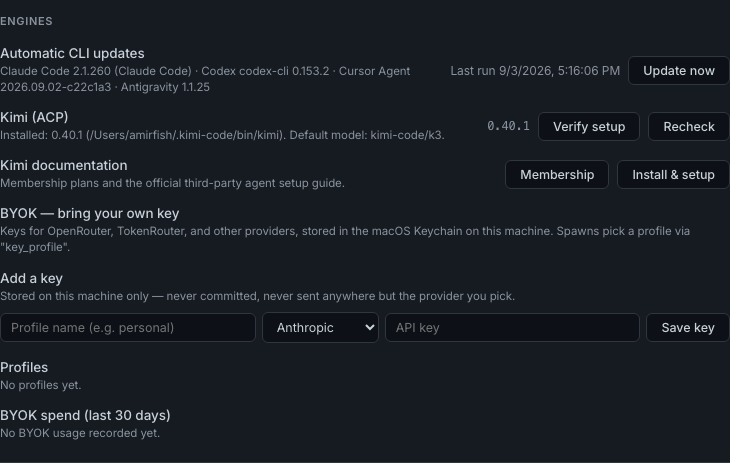

# Provider keys and other secrets

[Back to the README](../README.md) · [Security](../SECURITY.md)

## Bring your own key (BYOK)

Save provider API keys in **Settings > Engines** to use them for supported
spawns instead of the CLI's existing login. Keys belong to named profiles,
such as `work` or `personal`, so projects can use different providers.

### Storage

On macOS, CCC uses Keychain service `ccc-byok`. Elsewhere it uses a stdlib-only
encrypted file at `~/.claude/command-center/byok/profiles.enc.json`, with an
HMAC-SHA256 counter-mode stream cipher and machine-bound key. Keys are not
stored as plaintext files or committed to the repo.

### Providers and routing

Providers include Anthropic, OpenAI, OpenRouter, TokenRouter, xAI, Moonshot,
Google, and TypeSafe Jev (used for new-session folder guessing; see
[SECURITY.md](../SECURITY.md)).

OpenCode accepts ids such as `openrouter/anthropic/claude-sonnet-5` in
`<provider>/<vendor>/<model>` form. Select that model and a profile with the
matching provider key; no separate virtual engine is needed.

The `/api/sessions/spawn` payload accepts `"key_profile": "<name>"`. For an
`openrouter/` or `tokenrouter/` model with no explicit profile, CCC tries the
profile named `default`.

### Supported spawn paths

Direct BYOK environment injection is wired for **OpenCode, Droid, and Aider**
(`BYOK_DIRECT_ENV_ENGINES` in `ccc_server/byok.py`). Kilo and Hermes are listed
for future wiring. Pi's adapter resolves its CLI but reports "not yet wired";
no verified `pi exec` contract exists. Check `GET /api/engines/models` or
`ccc models` for current BYOK readiness.

`GET /api/engines/models` includes indicative per-token costs. BYOK spawns
record tokens and cost in a local ledger at `GET /api/byok/usage?days=30`,
shown in the Settings spend summary.

`ccc doctor` or `GET /api/engines/doctor` checks CLI presence, login where
supported, configured profiles, and whether the CLI binary resolves. This
check does not launch an agent or spend tokens.



## Vault: any other secret

Use **Settings > Vault** for secrets that are not LLM provider keys, such as
a service API key or website login.

An entry has a unique name, a kind (`api_key`, `token`, `login`, `other`),
a service label, and optional username, environment variable, website, and
notes. You can edit details, replace the value, or delete it.

Values live in macOS Keychain service `ccc-vault` with the entry name as the
account. Other platforms use the encrypted-file fallback at
`~/.claude/command-center/vault/secrets.enc.json`. Metadata is kept in
`~/.claude/command-center/vault/index.json` (mode 0600) without secret values.

No API returns the value. The UI shows when it was saved and a last-four hint
for long keys and tokens. BYOK keys appear in Vault too: **Import to Vault**
copies one into a new entry without removing the original BYOK key.

### Use secrets from scripts

The local CLI works without the server. Prefer `exec`: it keeps the value out
of the agent transcript and redacts it from the child's stdout and stderr.

```bash
ccc vault list [--json]                      # names, kinds, services, env vars, never values
ccc vault exec --env STRIPE_API_KEY=stripe-live -- ./deploy.sh
ccc vault exec --env stripe-live -- ./deploy.sh   # uses the entry's stored env var
ccc vault get stripe-live                    # exit 0 if saved; --reveal prints the value
```

### API

`GET /api/vault` returns metadata and BYOK rows. Writes use
`POST /api/vault/entries`, `/api/vault/entries/update`,
`/api/vault/entries/delete`, and `/api/vault/import-byok`. Every POST follows
the same-origin rule.
