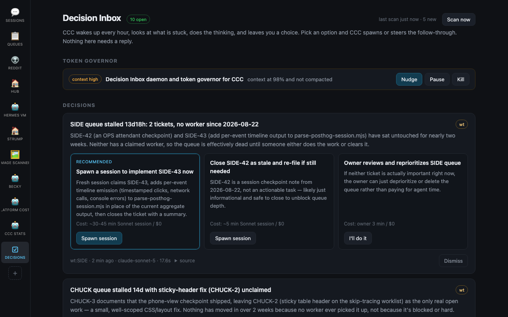

# Decision Inbox

[Back to the README](../README.md) · [Queues](QUEUES.md)

Once an hour, CCC checks for stalled work and uses an analyst model to prepare
three-option cards. You choose an option; CCC spawns or steers the follow-up.
Open **Decisions** from the app rail or `/decision-inbox.html`.

## What it checks

- **Strategy board, optional:** a Markdown table with `Task | Status | ETA`
  columns. Blocked rows and open rows past their ETA become candidates.
- **WatchTower queues:** open tickets older than `wt_age_days`, with one
  `wt status --json` per run and one `wt ls` per surfaced queue.
- **Idle sessions:** live sessions idle longer than `idle_hours` with unfinished
  work, such as a pending tool or open goal.

The token governor checks live sessions in the same pass. It flags repeated
tool errors, 45 minutes of work without file edits, or 85% context usage with
no compaction. Choose **Nudge**, **Pause**, or **Kill** for a flagged session.

There are at most five new cards per run. A source with an open card, or one
decided or dismissed in the last week, is skipped.



## Configuration

Save settings in `~/.claude/command-center/decision-inbox.json`:

```json
{
  "strategy_board": "~/notes/Strategy Board.md",
  "interval_s": 3600,
  "max_cards_per_run": 5,
  "idle_hours": 2,
  "wt_age_days": 3,
  "model": "claude-sonnet-5",
  "spawn_cwd": "~/projects"
}
```

Set `CCC_DECISION_INBOX_DISABLED=1` to disable the loop. Cards and run history
live in `~/.claude/command-center/decision-inbox/`.

## File cards from another tool

A digest, monitor, or scheduled script can post to `POST /api/decision-inbox`
(alias `/api/decision-inbox/cards`):

```json
{
  "source": "digest",
  "source_id": "example:check",
  "title": "Review the stalled task",
  "detail": "The task needs a decision before it can continue.",
  "severity": "warn"
}
```

The reply is `{ok, card_id, deduped}`. Cards deduplicate by `source:source_id`,
so repeats keep one open card and count repeated reports. Pass `options` for
custom choices; omit them for acknowledge, spawn an investigator, or snooze
for 24 hours.

Read with `GET /api/decision-inbox`; actions use
`POST /api/decision-inbox/{run,decide,dismiss,governor}`.
