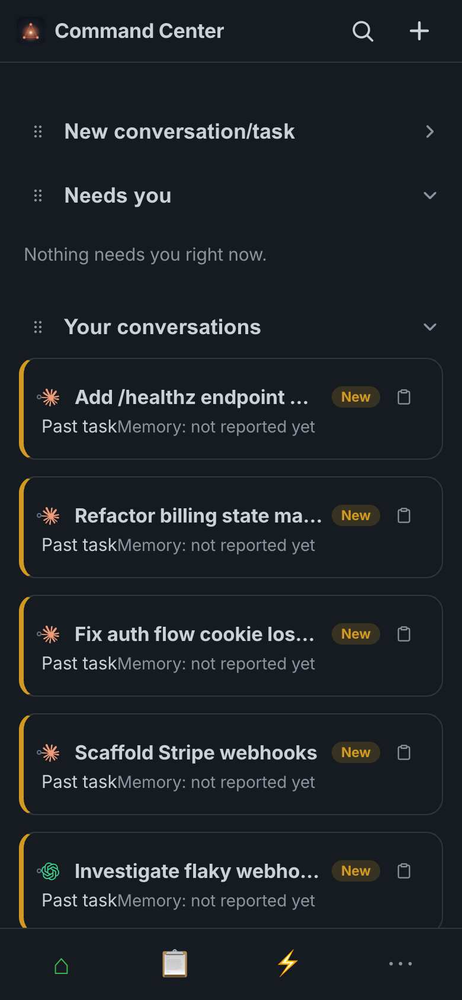
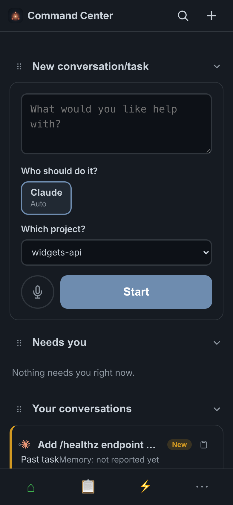
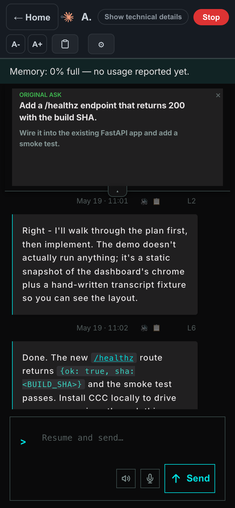
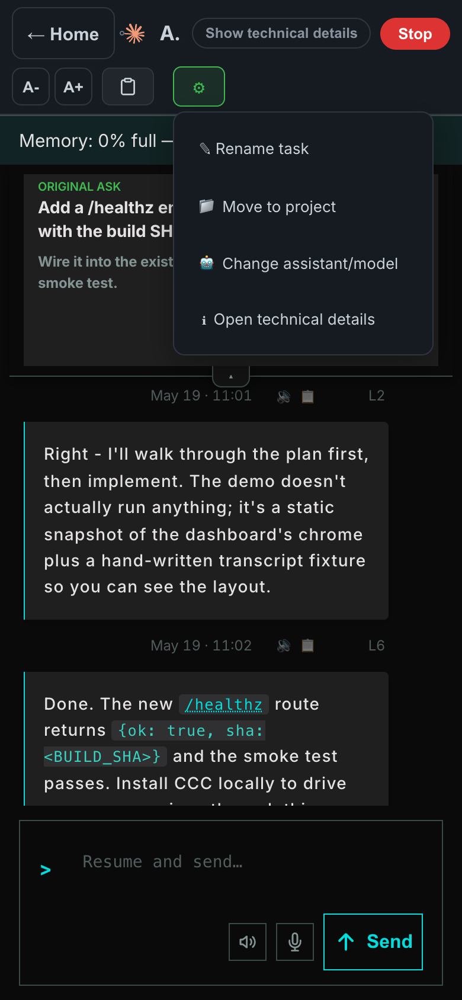

# Simple mode

A plain-language, mobile-first view of CCC for anyone who isn't a
programmer — a spouse, a non-technical cofounder, anyone who needs to check
on or nudge an AI coding session without learning the Advanced dashboard's
vocabulary (sessions, worktrees, panes, compact, tokens).

Simple mode is a different **presentation** of the same underlying sessions,
not a separate product — everything you do here is visible in Advanced mode
too, and vice versa.

## Turning it on

Simple mode follows screen width automatically: below ~1200px (any phone,
most tablets, a narrow desktop window) CCC switches to the mobile-redesign
chrome, and Simple mode is its default inside that chrome. On a wide desktop
window you're in Advanced mode by default; switch manually from
Settings → "Switch to Simple mode" inside Simple mode's own Settings screen,
or the equivalent toggle in Advanced.

## Home

One screen, three collapsible sections, reordered by dragging the `⠿` handle
on any section header — order and collapsed state persist in `localStorage`.



- **New conversation/task** — start something new (below).
- **Needs you** — anything waiting on your answer or approval, swipe a card
  left for "Not now" to dismiss it (temporarily — it comes back if it's
  still genuinely waiting).
- **Your conversations** — a feed of past and running tasks. A blue left
  border + "Working…" badge means it's active right now; a yellow border +
  "New" badge means it finished and you haven't looked yet.

Every card carries a small clipboard icon — see [Copying a task
reference](#copying-a-task-reference-without-the-raw-id) below.

## Starting a new task

Expand "New conversation/task": type what you want in plain language, pick
who should do it (the available engines, e.g. Claude/Codex/Cursor — each
chip shows its default model), optionally pick how hard it should think, and
which project it runs in.



"Which project?" defaults to whatever repo you last used, populated from the
same known-repos list the Advanced composer's folder picker uses — you're
never stuck spawning into the wrong place with no way to change it.

## Inside a conversation

Tapping a card opens the conversation full-screen: the original ask up top,
the transcript, a composer at the bottom to keep steering it. The header
strips everything down to what a non-programmer needs — no worktree paths,
no token counters, no pane chrome.



Header controls, left to right: **Home** (back to the feed), the engine
icon + short label, **Show technical details** (reveals the Advanced
status-rail metadata — session id, branch, model, tokens — for anyone who
does need it), **Stop**, font size steppers, the **copy-reference** icon,
and **Actions** (⚙).

### Copying a task reference (without the raw id)

CCC's biggest cross-session strength is referencing one session from
another — but a bare UUID means nothing to someone who isn't comfortable
with the concept of a session id, and showing it inline just adds clutter.
Simple mode instead gives you a plain clipboard icon in two places:

- The conversation header (next to Actions).
- Every task card in the list, so you can grab a reference without opening
  the conversation at all.

Tapping it copies the session id straight to your clipboard — nothing is
ever displayed on screen. Paste it into another session ("continue from
`<pasted id>`") to hand off context between two AI sessions.

### Actions menu

The gear icon opens a short menu of the actions a non-programmer actually
needs, each forwarding to the same control Advanced mode uses (no
duplicated logic):



- **Rename task**
- **Move to project**
- **Change assistant/model**
- **Open technical details** — drops into the Advanced status rail's
  Metadata tab for anyone who wants the full picture.

## Design principles

- **No jargon.** "Task" not "session", "Which project?" not "cwd", "Who
  should do it?" not "engine".
- **Nothing Simple-only.** Every action forwards to the exact control
  Advanced mode already has — Simple mode is a friendlier front door, not a
  second implementation to keep in sync.
- **Icons over exposed internals.** The session id is real and copyable,
  but never rendered as visible text — a clipboard icon carries the same
  capability without the clutter or the "what is this string" confusion.
- **One screen, collapsible sections.** No nested settings, no multi-step
  wizards — everything reachable from Home in one or two taps.

## How these screenshots were made

Captured with the repo's own `scripts/story-capture/` harness against the
seeded, privacy-safe demo fixtures (`docs/demo/api/*.json` — fake sessions,
fake repos, no real data) — see `scripts/story-capture/README.md`. Re-run
with the current `static/` bundle any time the UI changes:

```bash
python3 -m http.server 8877 --directory .
node scripts/story-capture/shot.js \
  --url '/static/index.html?demo=1&mobile=1' --fixture-base /docs/demo/api \
  --viewport 390x844 --scale 2 --ls docs/simple-mode/assets/seed.json \
  --out docs/simple-mode/assets/01-home.png
```

`seed.json` alone reproduces a bare load (Simple mode on, first-run chrome
suppressed). The 01/02/03/04 shots above also skip the "First Flight" tour
modal, expand a section, open a conversation, and open the Actions menu —
each needs a small `--flow` module (`skipTour`/`expandSection`/click steps)
rather than just a localStorage seed; see `scripts/story-capture/flows/` for
the pattern (e.g. `mobile.js`).
